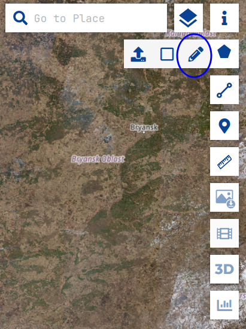
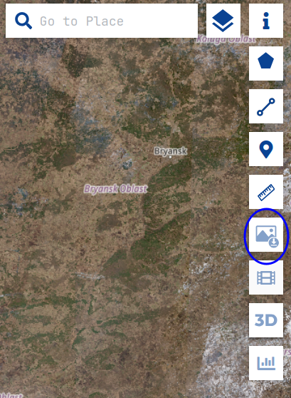
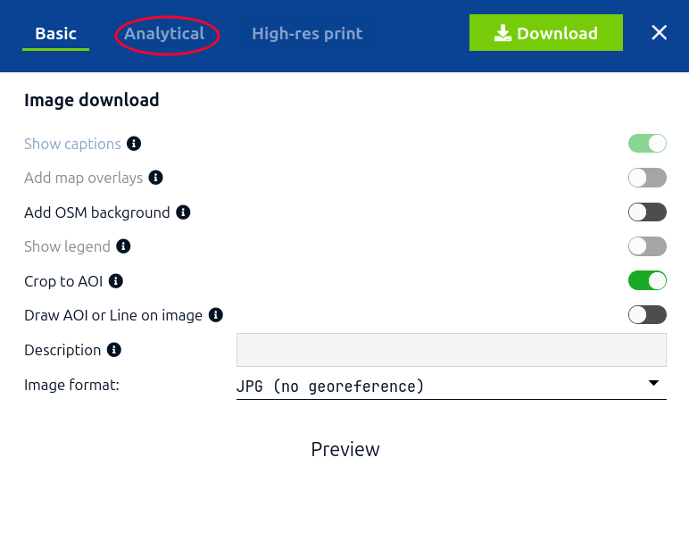

# Project Overview
A program that exports a satellite image to a 3D model (although technically it does not have to be a satellite image).  
## How to use

### Download satellite imagery  

To use the program, you first need a satellite image.  

You can find high quality images here:

<https://browser.dataspace.copernicus.eu/>  

Although keep in mind that you will need an account in order to download higher-res images.

You can use this to draw the area you want to download:

  

On the left is a menu, in which (I think) it is best to turn cloud coverage down to 0. You can also choose a layer -- I just chose the default 'true color' layer.  

Then press this button to download the image:  

  

Then, click this (you will need to create an account for this part):  



Save the image as a PNG for maximum quality.  

If you want a high quality model, and don't care about size, download the highest resolution option. If you care about size though, I have found medium quality to be the best; it keeps the .obj file under 100 megabytes for small areas, while also looking pretty decent.

### Create the .obj file
Run the install script:
```
chmod +x install.sh
./install.sh
```  
I haven't made it work for any other shell that isn't Fish, so modify `source .venv/bin/activate.fish` if needed.  

Move your downloaded satellite image to the `images/` directory created by the install script, and name it `satellite-image.png` because I'm lazy.  

Then run `main.py`:
```
python3 main.py
```  
You will find the exported `.obj` file in `model/`.


## TODO:
- Export to glb file ✅
- Embed in gsites ✅